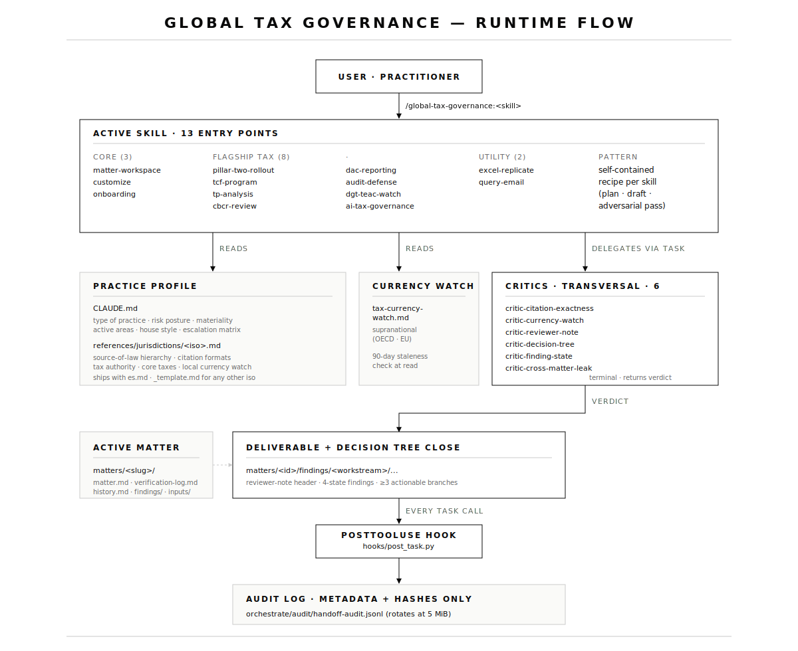

# global-tax-governance

[](https://opensource.org/licenses/MIT)
[](CHANGELOG.md)
[](.)

> Tax governance skill library for senior practitioners — Pillar Two, transfer pricing, TCF, DAC, CbCR, audit defense, AI Act in the tax function.
> Thirteen skills · six transversal critics · jurisdiction-agnostic practice profile · audit-only runtime.
> Built for in-house tax directors, Big Four advisors, boutique practices, and academic-practitioners.

---

## ARCHITECTURE

<p align="center">
  
</p>

Open [`docs/architecture.html`](docs/architecture.html) for the same diagram with annotations and a file-by-file map.

---

## QUICK INSTALL

Inside Claude Code:

```text
/plugin marketplace add SoyDonOnega/global-tax-governance
/plugin install global-tax-governance
/global-tax-governance:onboarding
```

The Python runtime (`orchestrate/orchestrate.py`) is optional — it ships as a validator + audit-log replayer. To enable it:

```bash
pip install -r requirements.txt
```

---

## STANDALONE OR WITH `claude-for-legal` (OPTIONAL)

**The plugin works fully standalone.** Every skill processes its own data: small document corpora (≤50 items) are read in-line, the six critics ship inside the plugin, and the audit hook runs without external dependencies.

**Optional enhancement.** If you also have the `claude-for-legal` plugin installed, the tax skills will offer to delegate larger or generic workloads to it (batch tabular review on >50 docs, M&A diligence issue extraction, cross-version regulatory diffs, AIA generation as a standalone exercise). The handoff is opt-in — you declare which companion plugins are active during `/onboarding`, and that choice lives in `## COMPANION PLUGINS` of `CLAUDE.md`.

| Scenario | What happens |
|---|---|
| **Standalone (default)** | Skills handle every workload in-line. Large corpora are processed in batches of ≤50 within the skill itself. Slower for batch work but no external plugin required. |
| **With `claude-for-legal` present** | Skills offer to delegate batch and generic workloads to `corporate-legal:tabular-review`, `corporate-legal:diligence-issue-extraction`, `regulatory-legal:reg-gap-analysis`, `regulatory-legal:policy-diff`, `commercial-legal:amendment-history`, `ai-governance-legal:aia-generation`. Faster for batch work, same tax-specific framing. |

`claude-for-legal` is **not a runtime dependency**. The plugin never errors if it is absent — it adapts.

---

## WHAT THIS PLUGIN IS

A library of thirteen tax-specific skills that:

- Encode senior-practitioner workflows (Pillar Two rollout, TCF program, TP documentation, DAC reporting, public/non-public CbCR, audit defense, AIA over AI Act in the tax function, etc.).
- Enforce a transversal disciplinary frame: reviewer-note header · currency watch · decision-tree close · verification log · four states of finding · function + strategy lens.
- Adapt to **your** jurisdiction — Spain ships as the seed profile; any other jurisdiction is one `references/jurisdictions/<iso>.md` away.

## WHAT THIS PLUGIN IS NOT

Not a multi-agent orchestration framework. Each skill runs as a self-contained recipe and only delegates to one of the six transversal critics for the disciplinary review pass. There is one runtime hook and it only writes the audit log.

---

## SKILLS (13)

### Core (3)
| Skill | Purpose |
|---|---|
| `/global-tax-governance:onboarding` | Cold-start interview · profile branching · jurisdiction selection · seed extraction with delta computation |
| `/global-tax-governance:customize` | Surgical edit of one slot with downstream impact analysis |
| `/global-tax-governance:matter-workspace` | Matter CRUD with cross-matter isolation toggle |

### Flagship tax (8)
| Skill | Coverage |
|---|---|
| `/global-tax-governance:pillar-two-rollout` | Pillar Two / GloBE multi-jurisdictional rollout (IIR · UTPR · QDMTT · safe harbours · GIR) |
| `/global-tax-governance:tcf-program` | Multi-phase TCF program (OECD FTA · NL HM · HMRC SAO/CCO · local cooperative-compliance regimes) |
| `/global-tax-governance:tp-analysis` | Master / local / CbCR + DEMPE + financial transactions + benefit test on intercompany services |
| `/global-tax-governance:cbcr-review` | Non-public + public CbCR + GRI 207 |
| `/global-tax-governance:dac-reporting` | DAC6 · DAC7 · DAC8 triage and payload |
| `/global-tax-governance:audit-defense` | Procedural defense across alegaciones · acta · TEAR · TEAC · jurisdicción |
| `/global-tax-governance:dgt-teac-watch` | Doctrine check + retroactive criterion change detection |
| `/global-tax-governance:ai-tax-governance` | AIA + AI Act + tax-admin selector defense |

### Utility (2)
| Skill | Purpose |
|---|---|
| `/global-tax-governance:excel-replicate` | Period rollforward preserving formulas + format (calc updates) |
| `/global-tax-governance:query-email` | Determinative client queries with normative basis |

---

## SIX TRANSVERSAL CRITICS

The only sub-agents that survive. Every skill invokes them at the close pass.

| Critic | Checks |
|---|---|
| `critic-citation-exactness` | Every cited authority matches its primary-source format. |
| `critic-currency-watch` | Every cited date / threshold / position in a moving area is current against the supranational watch + the local profile. |
| `critic-reviewer-note` | The reviewer-note header is complete and dated. |
| `critic-decision-tree` | Close carries a decision tree with ≥3 actionable branches. |
| `critic-finding-state` | Every finding has a state (`answered` · `not_present` · `unclear` · `needs_review`). No blanks. |
| `critic-cross-matter-leak` | No reference to a matter other than the active one when `Cross-matter context: off`. |

---

## JURISDICTION CONFIGURATION

The plugin ships **jurisdiction-agnostic** with Spain as the seed profile:

```
references/jurisdictions/
├── README.md         convention + file naming
├── _template.md      empty template (8 sections)
└── es.md             Spain seed profile
```

A jurisdiction profile is the source of truth for: source-of-law hierarchy, citation formats, tax authority and binding-ruling body, core taxes, local currency watch, anti-hallucination guardrails, and escalation triggers.

To add your jurisdiction:

```bash
cp references/jurisdictions/_template.md references/jurisdictions/<iso2>.md
# then run /global-tax-governance:customize to walk through it
```

`CLAUDE.md` declares the active jurisdiction via the `Primary jurisdiction` field and skills read it from there.

---

## TRANSVERSAL RULES (every skill applies)

1. **Hard anti-hallucination** — exact citation or no claim, against the authority list in the active jurisdiction profile.
2. **Reviewer note header** on every substantive deliverable.
3. **Decision tree** at close with ≥3 actionable branches.
4. **Currency check** against `references/resources/tax-currency-watch.md` (supranational) + `references/jurisdictions/<iso>.md` §5 (local). 90-day staleness check.
5. **Verification log** per matter against primary sources.
6. **Four states of finding** — never blank.
7. **Strategy lens + function lens** mandatory in substantive deliverables.
8. **Language by recipient** — default per profile, English for international HQ or academic publication.
9. **B&W minimalist aesthetic** — no gold, no colour, no emoji.
10. **Privilege protection** — cross-matter context isolated by default.

---

## RUNTIME (AUDIT-ONLY)

The plugin ships one Claude Code hook:

| Hook | Event | What it does |
|---|---|---|
| `post_task.py` | `PostToolUse` matcher `Task` | Appends one record per `Task` invocation to `orchestrate/audit/handoff-audit.jsonl` (timestamp · source · target · prompt hash · response hash). Metadata only — the prompt and response body are never stored. Rotates the log file at `GTG_AUDIT_ROTATE_BYTES` (default 5 MiB). |

To inspect the log:

```bash
python orchestrate/orchestrate.py --replay orchestrate/audit/handoff-audit.jsonl
```

`orchestrate/orchestrate.py` also validates handoff payloads against the closed-schema (three intents: `critic_check`, `request_clarification`, `escalate_to_human`):

```bash
python orchestrate/orchestrate.py --validate-only --payload sample.json
```

---

## REPOSITORY

- **Source**: https://github.com/SoyDonOnega/global-tax-governance
- **License**: [MIT](LICENSE)
- **Security policy**: [SECURITY.md](SECURITY.md)
- **Changelog**: [CHANGELOG.md](CHANGELOG.md)
- **Contributing**: [CONTRIBUTING.md](CONTRIBUTING.md)
- **Code of conduct**: [CODE_OF_CONDUCT.md](CODE_OF_CONDUCT.md)
- **Guide**: [GUIDE.md](GUIDE.md)
- **Jurisdictions**: [`references/jurisdictions/`](references/jurisdictions/)
- **Currency watch**: [`references/resources/tax-currency-watch.md`](references/resources/tax-currency-watch.md)

---

## REQUIREMENTS

- Python 3.10+ (only for `orchestrate.py` and the audit hook).
- Skills and critics are pure markdown — no runtime dependencies.

```bash
pip install -r requirements.txt
```

See [`CONNECTORS.md`](CONNECTORS.md) for optional MCP integrations (filesystem-only by default).
